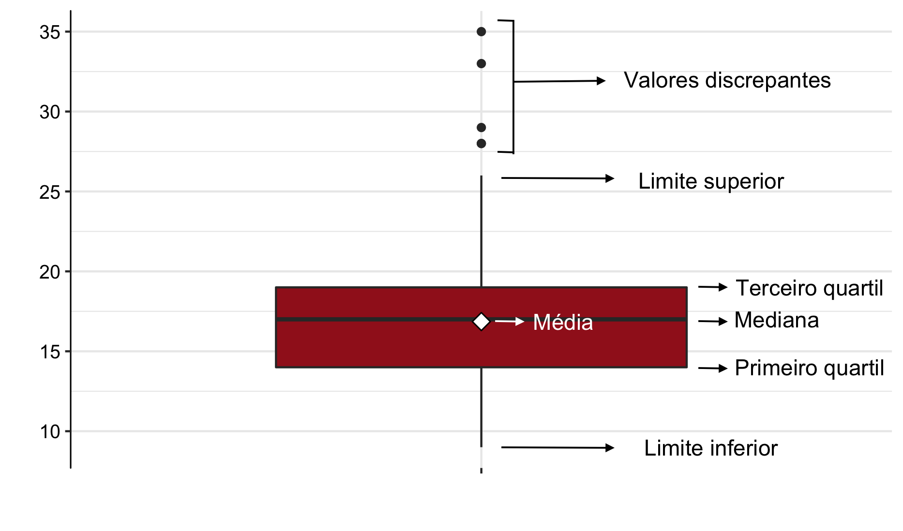

---
# Nome do arquivo PDF gerado na pasta resultado
output-file: "Relatório Final - Vítor Camboim Simeão"
title: "Relatório Final Pixel110011"
header-includes:
  - \usepackage{placeins}
---

```{r setup}
#| include: false
source("rdocs/entrega1.R")
source("rdocs/entrega2.R")
source("rdocs/entrega3.R")
source("rdocs/entrega4.R")
```

```{r}
# Rodar apenas uma vez na vida!
## Instalando o tinytex(pacote apenas)
### CRAN version


## Baixando o tinytex
library(tinytex)

```

# Introdução

O seguinte projeto tem como objetivo aplicar técnicas de Estatística Descritiva na análise de um banco de dados relacionado ao mercado de jogos digitais. Com essa finalidade, foram realizadas análises envolvendo a distribuição das idades dos usuários por plataforma, a evolução da receita mensal do jogo Minecraft durante o ano de 2025, a relação entre a idade dos jogadores e o tempo médio mensal gasto na plataforma por meio do coeficiente de correlação de Pearson, e a identificação dos três produtos mais vendidos dentro dos três jogos mais bem avaliados em 2024. As análises foram conduzidas com caráter exploratório e descritivo, buscando reconhecer padrões e particularidades presentes nos dados.

O banco de dados "pixel110011" utilizado abrange informações sobre jogadores, jogos, produtos e compras realizadas em uma plataforma de jogos digitais. Entre as variáveis em discussão situam-se idade, sexo, país de origem, plataforma utilizada, quantidade de logins, tempo médio de sessão, avaliações dos jogos, produtos adquiridos, quantidade vendida e valores de compra.

Para a realização das análises em questão foi utilizado o software R, versão 4.5.1, por meio do ambiente de desenvolvimento RStudio. O software foi utilizado na manipulação dos dados, elaboração dos gráficos, construção dos quadros e obtenção das medidas estatísticas necessárias para a interpretação dos resultados apresentados a seguir.

# Referencial Teórico

Este relatório é composto por técnicas estatísticas que serão descritas no Referencial Teórico, as quais foram aplicadas de acordo com os objetivos de cada análise realizada.

## Tipos de Variáveis

### Qualitativas

As variáveis qualitativas são as variáveis não numéricas, que representam categorias ou características da população. Estas subdividem-se em:

-   **Nominais**: quando não existe uma ordem entre as categorias da variável (exemplos: sexo, cor dos olhos, fumante ou não, etc)
-   **Ordinais**: quando existe uma ordem entre as categorias da variável (exemplos: nível de escolaridade, mês, estágio de doença, etc)

### Quantitativas

As variáveis quantitativas são as variáveis numéricas, que representam características numéricas da população, ou seja, quantidades. Estas subdividem-se em:

-   **Discretas**: quando os possíveis valores são enumeráveis (exemplos: número de filhos, número de cigarros fumados, etc)
-   **Contínuas**: quando os possíveis valores são resultado de medições (exemplos: massa, altura, tempo, etc)

## Medidas-resumo

### Média

A média é a soma das observações dividida pelo número total delas, dada pela fórmula:

$$\bar{X}=\frac{\sum\limits_{i=1}^{n}X_i}{n}$$

### Mediana

Sejam as $n$ observações de um conjunto de dados $X=X_{(1)},X_{(2)},\ldots, X_{(n)}$ de determinada variável ordenadas de forma crescente. A mediana do conjunto de dados $X$ é o valor que deixa metade das observações abaixo dela e metade dos dados acima.

Com isso, pode-se calcular a mediana da seguinte forma:

$$
med(X) =
    \begin{cases}
         X_{\frac{n+1}{2}}, \textrm{para n ímpar} \\
         \frac{X_{\frac{n}{2}}+X_{\frac{n}{2} + 1}}{2}, \textrm{para n par} \\
    \end{cases}
$$

### Quartis

Os quartis são separatrizes que dividem o conjunto de dados em quatro partes iguais. O primeiro quartil (ou inferior) delimita os 25% menores valores, o segundo representa a mediana, e o terceiro delimita os 25% maiores valores. Inicialmente deve-se calcular a posição do quartil:

-   Posição do primeiro quartil $P_1$: $$P_1=\frac{n+1}{4}$$

-   Posição da mediana (segundo quartil) $P_2$: $$P_2 = \frac{n+1}{2}$$

-   Posição do terceiro quartil $P_3$: $$P_3=\frac{3 \times (n+1)}{4}$$

Com $n$ sendo o tamanho da amostra. Dessa forma, $X_{\left( P_i \right)}$ é o valor do $i$-ésimo quartil, onde $X_{\left( j \right)}$ representa a $j$-ésima observação dos dados ordenados.

Se o cálculo da posição resultar em uma fração, deve-se fazer a média entre o valor que está na posição do inteiro anterior e do seguinte ao da posição.

### Variância Amostral

Para uma amostra, a variância é dada por:

$$S^2=\frac{\sum\limits_{i=1}^{n}\left(X_i - \bar{X}\right)^2}{n-1}$$

Com:

-   $X_i =$ i-ésima observação da amostra

-   $\bar{X} =$ média amostral

-   $n =$ tamanho da amostra

### Desvio Padrão Amostral

Para uma amostra, o desvio padrão é dado por:

$$S=\sqrt{\frac{\sum\limits_{i=1}^{n}\left(X_i - \bar{X}\right)^2}{n-1}}$$

Com:

-   $X_i =$ i-ésima observação da amostra

-   $\bar{X} =$ média amostral

-   $n =$ tamanho da amostra

## Boxplot

O boxplot é uma representação gráfica na qual se pode perceber de forma mais clara como os dados estão distribuídos. A figura abaixo ilustra um exemplo de boxplot.

{fig-align="center"}

A porção inferior do retângulo diz respeito ao primeiro quartil, enquanto a superior indica o terceiro quartil. Já o traço no interior do retângulo representa a mediana do conjunto de dados, ou seja, o valor em que o conjunto de dados é dividido em dois subconjuntos de mesmo tamanho. A média é representada pelo losango branco e os pontos são *outliers*. Os *outliers* são valores discrepantes da série de dados, ou seja, valores que não demonstram a realidade de um conjunto de dados.

## Gráfico de Linhas

O gráfico de linhas é uma representação gráfica utilizada para acompanhar a evolução de uma variável ao longo de uma sequência ordenada, geralmente temporal. Os pontos observados são conectados por segmentos de reta, permitindo a visualização de tendências, oscilações e padrões ao longo do período analisado

## Gráfico de Dispersão

O gráfico de dispersão é uma representação gráfica utilizada para ilustrar o comportamento conjunto de duas variáveis quantitativas. A figura abaixo ilustra um exemplo de gráfico de dispersão, onde cada ponto representa uma observação do banco de dados.

{fig-align="center"}

## Coeficiente de Correlação de Pearson

O coeficiente de correlação de Pearson é uma medida que verifica o grau de relação linear entre duas variáveis quantitativas. Este coeficiente varia entre os valores -1 e 1. O valor zero significa que não há relação linear entre as variáveis. Quando o valor do coeficiente $r$ é negativo, diz-se existir uma relação de grandeza inversamente proporcional entre as variáveis. Analogamente, quando $r$ é positivo, diz-se que as duas variáveis são diretamente proporcionais.

O coeficiente de correlação de Pearson é normalmente representado pela letra $r$ e a sua fórmula de cálculo é:

$$
r_{Pearson} = \frac{\displaystyle \sum_{i=1}^{n} \left [ \left(x_i-\bar{x}\right) \left(y_i-\bar{y}\right) \right]}{\sqrt{\displaystyle \sum_{i=1}^{n} x_i^2 - n\bar{x}^2}  \times \sqrt{\displaystyle \sum_{i=1}^{n} y_i^2 - n\bar{y}^2}}
$$

Onde:

-   $x_i =$ i-ésimo valor da variável $X$
-   $y_i =$ i-ésimo valor da variável $Y$
-   $\bar{x} =$ média dos valores da variável $X$
-   $\bar{y} =$ média dos valores da variável $Y$

Vale ressaltar que o coeficiente de Pearson é paramétrico e, portanto, sensível quanto à normalidade (simetria) dos dados.

## Gráfico de Colunas

O gráfico de colunas é uma representação gráfica utilizada para comparar valores entre diferentes categorias. Cada categoria é representada por uma coluna cuja altura é proporcional ao valor observado, permitindo a identificação de diferenças e padrões entre os grupos analisados.

# Análises

## Análise distribuição das idades por plataforma

  Esta análise foi feita com o objetivo de entender como a idade está distribuida com base em plataformas diferentes. Para isso, foi utilizado o box plot, um gráfico fundamental para visualizar distribuição, dispersão, assimetria e mediana de conjuntos de dados numéricos. Essa ferramenta é ideal para comparar múltiplos grupos, identificar valores discrepantes (outliers) rapidamente e analisar a variabilidade. Nessa amostra, composta por 250 usuários, foram consideradas duas variáveis em questão, idade e plataforma, classificadas como quantitativa contínua e qualitativa nominal, respectivamente. Além disso, foi construído um quadro, que tem como objetivo apresentar medidas-resumo presentes no gráfico como média, mediana, quartis, desvio padrão, variância, máximo e mínimo.

```{r}
#| label: fig-boxplot_meios
#| fig-cap: "Gráfico da Idade dos Usuários por Plataforma"
boxplot_idade_plataforma
```


```{r}

``` 

```{=latex}
\begin{quadro}[H]
	\setlength{	\tabcolsep}{9pt}
	\renewcommand{	\arraystretch}{1.20}
	\caption{Medidas resumo da Idade por Plataforma}
	\label{quad:quadro_resumo1}
	\centering
	\begin{adjustbox}{max width=\textwidth}
	\begin{tabular} { | l |
			S[table-format = -Inf.2]
			S[table-format = -Inf.2]
			S[table-format = -Inf.2]
			|}
	\hline
		\textbf{Estatística} & \textbf{Celular} & \textbf{Computador} & \textbf{Console} \\
		\hline
		Média & 23,74 & 23,47 & 22,59 \\
		Desvio Padrão & 9,30 & 9,19 & 8,87 \\
		Variância & 86,45 & 84,40 & 78,65 \\
		Mínimo & 10 & 10 & 10 \\
		1º Quartil & 16 & 15 & 15 \\
		Mediana & 23 & 24 & 23 \\
		3º Quartil & 29 & 28 & 29 \\
		Máximo & 45 & 45 & 45 \\
	\hline
	\end{tabular}
	\end{adjustbox}
\end{quadro}

```


  Tendo como base a $\ref{fig-boxplot_meios}$ e o \hyperref[quad:quadro_resumo1]{\textbf{Quadro~\ref*{quad:quadro_resumo1}}}, observa-se que as distribuições das idades entre as 3 plataformas digitais apresentam comportamentos bastante semelhantes. As médias de idade variam entre 22 e 24 anos, indicando assim que não há diferenças discrepantes na faixa etária entre os meios de utilização analisados. Por conseguinte, as medianas e os quartis também estiveram relativamente próximos, demonstrando equilíbrio entre os grupos. Entretanto, os usuários de computador apresentaram uma mediana um pouco superior às demais, indicando tendência de público um pouco mais velho. Os desvios padrão estão próximos à 9 anos, revelando assim dispersões parecidas e variabilidade moderada das idades em geral. Em sumo, conclui-se que, mesmo havendo uma diferenças entre as analisadas plataformas, os jogadores possuem idades parecidas em todos os grupos, ou seja, isso mostra que o perfil etário dos usuários é bem homogêneo, não importando qual plataforma eles usem para jogar.

## Receita mensal de 2025 do jogo "Minecraft"

A análise a seguir tem como objetivo investigar a receita mensal do jogo "Minecraft" durante o ano de 2025. Para isso, foi construído um gráfico de linhas representando a evolução do faturamento em dólares ao longo dos meses. Além disso, foi elaborado um quadro contendo os valores da receita em dólar e em real, permitindo uma descrição mais detalhada do comportamento financeiro do jogo durante o período analisado. Foram consideradas as variáveis receita total e mês, classificadas como quantitativa contínua e qualitativa ordinal. Outrossim, a receita total foi calculada por meio da soma do valor de cada item vendido, levando em conta a quantidade, e transformada em dólares, utilizando a cotação de 1 US$ = 5,19 R$.

```{r}
#| label: fig-grafico_receita_2025
#| fig-cap: "Gráfico da Receita pelos Meses de 2025 do Jogo \"Minecraft\""
grafico_receita_2025
```


```{=latex}
\begin{quadro}[H]
    \setlength{\tabcolsep}{9pt}
    \renewcommand{\arraystretch}{1.20}
    \caption{Receita mensal do Minecraft em 2025}
    \centering
    \begin{adjustbox}{max width=\textwidth}
    \begin{tabular}{|c|c|c|}
        \hline
        \textbf{Mês} & \textbf{Receita (R\$)} & \textbf{Receita (US\$)} \\
        \hline
        jan & 203,03 & 39,12 \\
        fev & 254,05 & 48,95 \\
        mar & 229,06 & 44,13 \\
        abr & 203,03 & 39,12 \\
        mai & 133,02 & 25,63 \\
        jun & 324,06 & 62,44 \\
        jul & 247,86 & 47,76 \\
        ago & 762,55 & 146,93 \\
        set & 1721,32 & 331,66 \\
        out & 1660,81 & 320,00 \\
        nov & 1646,59 & 317,26 \\
        dez & 1117,41 & 215,30 \\
        \hline
    \end{tabular}
    \label{quad:quadro_receita}
    \end{adjustbox}
\end{quadro}
```

```{=latex}
\FloatBarrier
```


Como observado na $\ref{fig-grafico_receita_2025}$ e conforme apresentado no \hyperref[quad:quadro_receita]{\textbf{Quadro~\ref*{quad:quadro_receita}}}, a receita mensal demonstrou crescimento ao longo do ano de 2025, com maior e menor valor registrado em setembro e maio, respectivamente. Nos primeiros meses do ano, os valores permaneceram mais baixos e sem grandes variações. Entretanto, a partir de agosto, o faturamento passou a crescer de forma mais acentuada. Entre setembro e novembro, continuou em níveis elevados, mantendo o padrão de crescimento observado no segundo semestre. Já em dezembro, houve uma queda em relação aos meses anteriores, apesar de o valor ainda ser superior aos registrados no início do ano. Dessa forma, observa-se que o desempenho financeiro apresentou crescimento relevante ao longo de 2025, principalmente durante o segundo semestre.

## Tempo mensal médio gasto pela idade

Esta análise tem como objetivo comparar o tempo médio mensal gasto em função da idade dos jogadores. Para isso, foi considerada uma amostra de 250 jogadores. As variáveis analisadas foram idade (em anos) e tempo médio gasto por mês (em horas), sendo ambas classificadas como quantitativas contínuas. O tempo médio por mês foi calculado a partir das variáveis quantidade de logins mensais e tempo médio de sessão (em minutos), depois transformado em horas. Para representar essa comparação, foi construído um gráfico de dispersão, permitindo observar o comportamento do tempo médio mensal em função da idade. Além disso, foram construídos dois quadros que representam medidas-resumo (média, mediana,...) das duas variáveis de forma separada. Por conseguinte, também foi calculado o coeficiente de correlação de Pearson, que tem o objetivo de avaliar a intensidade da relação linear entre as variáveis.

```{r}
#| label: fig-tempoporidade
#| fig-cap: "Gráfico do Tempo Médio Mensal Gasto em Função da Idade"
grafico_idade_tempo
```

```{=latex}
\begin{quadro}[H]
	\setlength{	\tabcolsep}{9pt}
	\renewcommand{	\arraystretch}{1.20}
	\caption{Medidas resumo da idade dos jogadores}
	\centering
	\begin{adjustbox}{max width=\textwidth}
	\begin{tabular} { | l |
			S[table-format = -Inf.2]
			|}
	\hline
		\textbf{Estatística} & \textbf{Valor} \\
		\hline
		Média & 23,16 \\
		Desvio Padrão & 9,36 \\
		Variância & 87,53 \\
		Mínimo & 10 \\
		1º Quartil & 15 \\
		Mediana & 23 \\
		3º Quartil & 28 \\
		Máximo & 45 \\
	\hline
	\end{tabular}
	\label{quad:quadro_idade}
	\end{adjustbox}
\end{quadro}
```

```{=latex}
\begin{quadro}[H]
	\setlength{	\tabcolsep}{9pt}
	\renewcommand{	\arraystretch}{1.20}
	\caption{Medidas resumo do tempo médio mensal gasto pelos jogadores}
	\centering
	\begin{adjustbox}{max width=\textwidth}
	\begin{tabular} { | l |
			S[table-format = -Inf.2]
			|}
	\hline
		\textbf{Estatística} & \textbf{Valor} \\
		\hline
		Média & 7,17 \\
		Desvio Padrão & 7,46 \\
		Variância & 55,62 \\
		Mínimo & 0 \\
		1º Quartil & 2,4 \\
		Mediana & 5,25 \\
		3º Quartil & 9,05 \\
		Máximo & 62,3 \\
	\hline
	\end{tabular}
	\label{quad:quadro_tempo}
	\end{adjustbox}
\end{quadro}
```

A partir do $\hyperref[quad:quadro_idade]{\textbf{Quadro~\ref*{quad:quadro_idade}}}$ e do $\hyperref[quad:quadro_tempo]{\textbf{Quadro~\ref*{quad:quadro_tempo}}}$, percebe-se que a idade dos jogadores apresentou média de 23,16 e mediana de 23 anos, indicando que a distribuição está centrada nessa faixa etária. Em relação ao tempo médio mensal, verificou-se média de 7,17 e mediana de 5,25 horas, sugerindo que parte dos jogadores apresenta tempos de utilização superiores à média observada. Outrossim, o valor máximo de 62,3 horas evidencia a existência de jogadores com uso significativamente mais elevado da plataforma.

Com base na $\ref{fig-tempoporidade}$ de dispersão apresentada, observa-se que os valores estão dispersos ao longo das idades, indicando que não há tendência significativa de aumento ou diminuição do tempo gasto conforme a idade aumenta. Por conseguinte, nota-se visualmente a presença de alguns valores discrepantes, ou seja, mais elevados, embora a maior concentração permaneça próxima aos menores valores do eixo vertical. Ademais, o coeficiente de correlação de Pearson encontrado foi r = 0,089, indicando uma associação positiva muito fraca entre as variáveis em questão. Dessa forma, observa-se que há uma associação linear muito fraca entre a idade e o tempo médio mensal gasto pelos jogadores.

## Top 3 produtos mais vendidos dentro dos três jogos mais bem avaliados em 2024

Esta análise tem como objetivo identificar os três produtos mais vendidos nos três jogos mais bem avaliados em 2024. Para isso, foram calculadas as notas médias dos jogos por meio da variável "nota_jogo", classificada como quantitativa contínua, o que permitiu selecionar aqueles com melhor avaliação. Por conseguinte, foram identificados os três produtos com maior quantidade de vendas dentro de cada um desses mesmos jogos. Foi considerada uma amostra de 250 usuários. As variáveis jogo, quantidade de vendas e produto foram classificadas como qualitativa nominal, quantitativa discreta e qualitativa nominal, respectivamente. Além disso, para apresentar os resultados, foi construído um gráfico de colunas, que visa representar visualmente a análise feita.

```{r}
#| label: fig-grafico_top3_produtos
#| fig-cap: "Três produtos produtos mais vendidos nos três jogos mais bem avaliados em 2024"
grafico_top3_produtos
```

Conforme está na $\ref{fig-grafico_top3_produtos}$, os três jogos com maiores notas médias de 2024 foram The Sims, Minecraft e Fortnite. A partir dessa seleção, a mesma $\ref{fig-grafico_top3_produtos}$ apresenta os três produtos mais vendidos em cada um dos jogos selecionados. Observa-se que, no Fortnite, Crew (1 Mês) foi o produto mais vendido tanto no próprio jogo quanto entre todos os produtos considerados na análise, totalizando 48 unidades, seguido por V-Bucks 1000 (47) e por V-Bucks 2800 (45). No The Sims, o Pacote de Objetos apresentou a maior quantidade de vendas (40), seguido pelo Kit de Moda (37) e pelo Pacote de Expansão (30). Já no Minecraft, os produtos Marketplace: Mundo Aventura e Texture Pack Premium registraram as maiores quantidades vendidas, ambos com 39 unidades, enquanto Minecoins 3.500 e Minecraft Realms (1 Mês) apresentaram 30 unidades vendidas. Como houve empate na terceira posição, os dois produtos foram representados no gráfico. De modo geral, as quantidades vendidas variaram entre 30 e 48 unidades, indicando que os produtos de maior destaque dos jogos analisados apresentaram níveis de vendas relativamente próximos.

# Conclusão

As análises realizadas tornaram-se fulcrais para compreender aspectos relevantes, assim foi possível descrever padrões e características do comportamento dos usuários e do desempenho dos jogos presentes na plataforma em questão. Os resultados indicaram que a distribuição das idades dos jogadores se mantém relativamente semelhante entre as diferentes plataformas, sugerindo um perfil etário equilibrado entre os usuários. Por conseguinte, observou-se um crescimento da receita do jogo Minecraft ao longo do ano de 2025, evidenciando um aumento na receita durante o período analisado. Em relação aos hábitos de utilização da plataforma, verificou-se que a idade dos jogadores apresenta pouca influência sobre o tempo médio mensal gasto em jogos, indicando comportamentos semelhantes entre diferentes faixas etárias. Por fim, a identificação dos produtos mais vendidos dentro dos jogos mais bem avaliados permitiu destacar as preferências de consumo dos usuários, fornecendo informações que podem contribuir para futuras estatégias relacionadas à oferta de produtos e à gestão dos jogos disponíveis na plataforma.